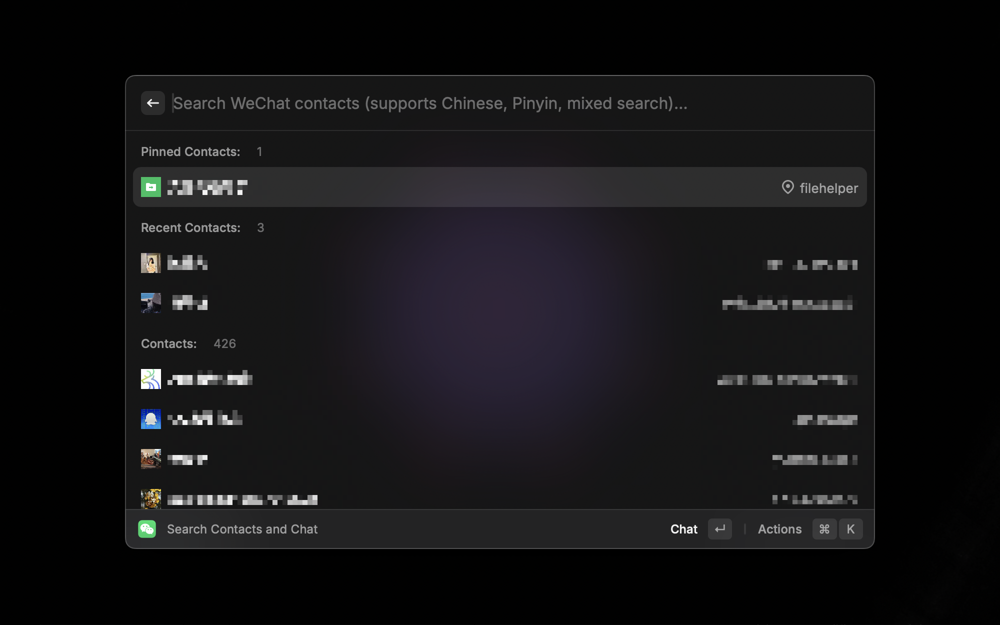

# Wechat

A [Raycast](https://www.raycast.com) extension for Wechat to quickly search your contacts and chat.

## Requirements

1. Install [Wechat for Mac](https://www.Wechat.com)
2. Install [WechatTweak-macOS](https://github.com/Sunnyyoung/WechatTweak-macOS)

## Features

- [x] Search Contact / 搜索微信通讯录好友
- [x] List Search Contact Numbers / 显示检索的好友数量
- [x] Open Contact / 打开微信好友
- [x] List Wechat ID / 显示好友微信ID
- [x] Copy Wechat ID / 复制微信ID
- [x] Display Avatar / 显示微信头像
- [x] Detect if Wechat & WechatExtension is installed / 检测微信以及WechatExtension是否安装
- [x] Support fuzzy query / 微信通讯录模糊查询

## Shortcuts
`Enter` Open Wechat Contact / 打开微信好友

`Command + c`Copy Wechat Contact ID / 复制微信好友ID

`Command + Shift + p` Pin Wechat Contact / 置顶好友

`Command + Shift + x` Clear Search History / 清楚好友搜索记录

## How to Use

- Raycast Store

- Manual Install

`npm install && npx ray develop`

## License

[MIT](LICENSE)
